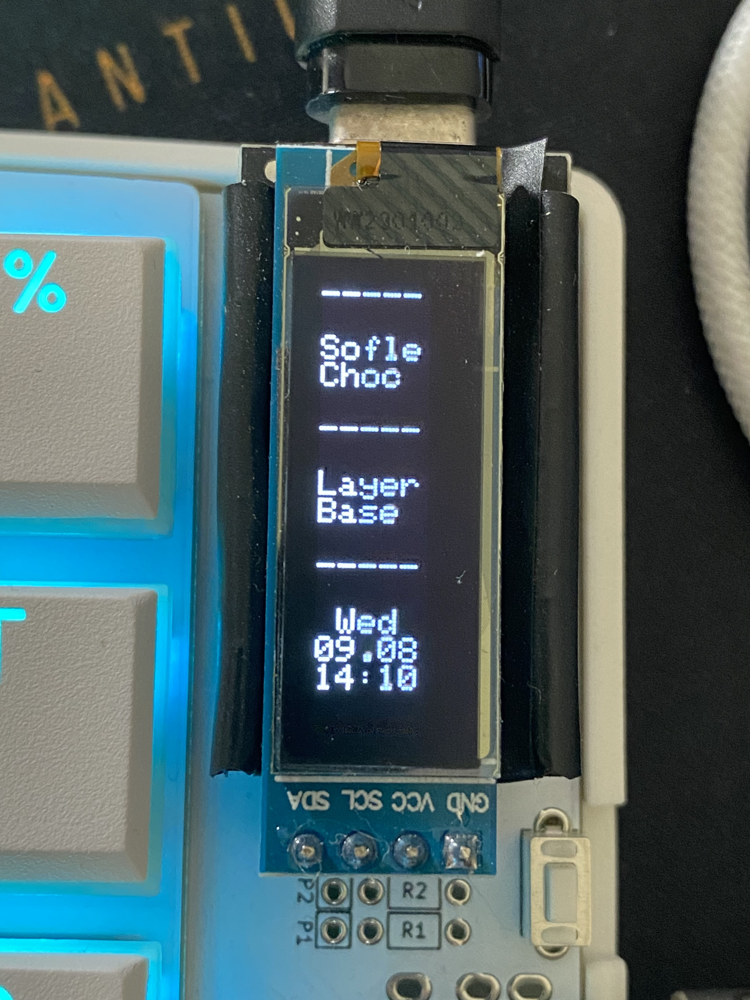
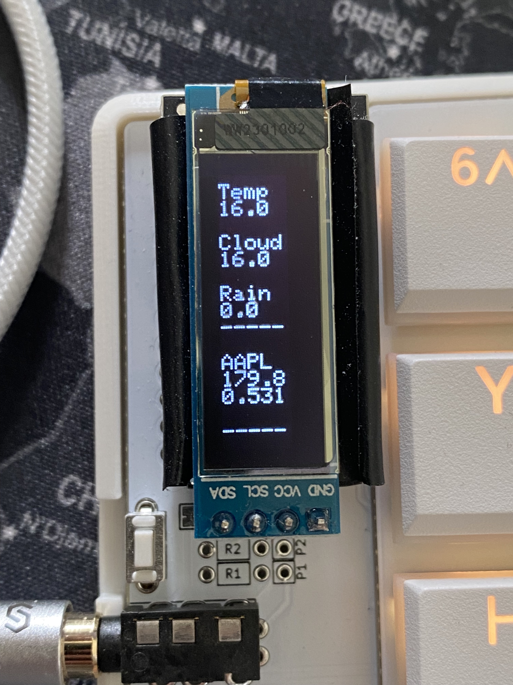

# 📺 Custom OLED content for Sofle Choc 
> Software running on the host to supply a connected sofle choc keyboard with custom content for its two OLED screens. By default, that is the local time and weather, as well as the current price of a stock on the stock exchange.   

## 👨🏻‍💻 Intro
The software is written to work with the sofle choc keyboard. An example of how it looks can be seen here:

 

 
  
...or here as GIF

   

It works by the host sending 160 bytes of data in chunks of 32 bytes to the keyboard, which accepts the input and divides it to its two screens (80 bytes per screen).
Additionally, the keyboard reports back to the host which layer of the keyboard is currently active so the content sent to the keyboard can be modified depending on the active layer.
While the weather data is cached and only refreshed after the by the weather service provided expiry date has passed, the stock market data is updated on every keyboard-layer switch.

Although not tested, with a bit of modification of the qmk firmware it should also work with all other split keyboards running qmk with two OLEDs. For that have a look into [this](https://github.com/robinerol/qmk_firmware/commit/eba1462925b17a38d95ef1747a19826622c39083) commit and add the required parts to your firmware.

## 🚀 Getting Started
1. Clone, build, and install the code modified qmk firmware that can be found [here](https://github.com/robinerol/qmk_firmware/commits/choc-robin) on your keyboard. It's the `hid` firmware inside the `sofle_choc` keyboard.
2. Copy the `.env_template` inside the `src > main > resources` folder, rename it to `.env` and fill out the missing fields. Info about the weather API can be found [here](https://developer.yr.no/doc/TermsOfService/). Info about the stock market API can be found [here](https://finnhub.io/docs/api/).
3. Run the project using the `main` inside `src > main > kotlin > Main.kt`.
4. Connect your keyboard. This should be all.

## 📝 Attribution
First and foremost a huge "Thank you!" to everyone who contributed making the [sofle keyboards](https://josefadamcik.github.io/SofleKeyboard/) in the first place. Furthermore to [Brian Low](https://github.com/brianlow) for creating the choc variant of the sofle keyboard.

#### 🧮 QMK Firmware
All of this works on the keyboard due to the awesome work tons of people have put into the [qmk firmware](https://github.com/qmk/qmk_firmware)/[license](https://github.com/qmk/qmk_firmware/blob/master/LICENSE).

#### 📡 HID Communication
HID communication from kotlin works due to the awesome work of these people [here](https://github.com/gary-rowe/hid4java)/[license](https://github.com/gary-rowe/hid4java/blob/develop/LICENSE).

#### 🌦️ Weather Data
Weather data comes from `The Norwegian Meteorological Institute`. Check out their [website](https://developer.yr.no/) and [license](https://developer.yr.no/doc/License/) for more info.

#### 📈 Stock Market Data
Stock market data comes from `Finnhub.io` using their dedicated kotlin client. Check out their [client](https://github.com/Finnhub-Stock-API/finnhub-kotlin) and [license](https://github.com/Finnhub-Stock-API/finnhub-kotlin/blob/master/LICENSE) for more info.

## 📜 License

